# DDDプロジェクト

このプロジェクトは、GoでDomain-Driven Design（DDD）の原則を基本的に実装したものです。

## プロジェクト構造

- `command/user`: ユーザーのコマンドハンドラーとサービスを含む
- `entities`: コアエンティティ（例：User、Plant）を定義
- `query/plant`: 植物のクエリハンドラーとリポジトリを含む
- `rdb`: データベース関連ファイルを含む
- `migrations`: データベースマイグレーションファイル

## 依存関係

- `github.com/gin-gonic/gin`: Webフレームワーク
- `github.com/go-sql-driver/mysql`: MySQLドライバー

## 実行方法

1.  依存関係をインストール: `go mod tidy`
2.  アプリケーションを実行: `go run main.go`

## クラス図

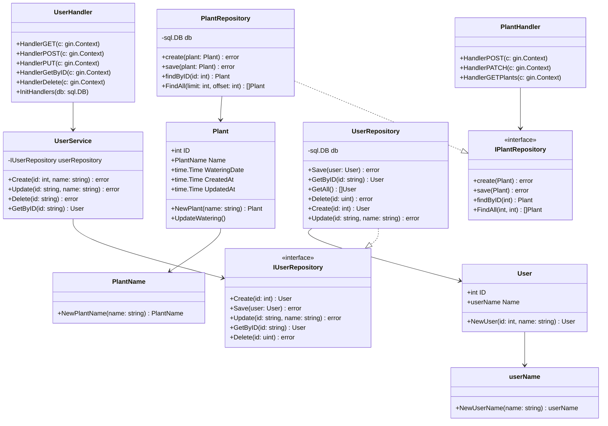

## ユースケース一覧

### ユーザー管理
- **UC-U1**: ユーザー登録 - 新しいユーザーを作成する
- **UC-U2**: ユーザー情報取得 - 特定のユーザー情報を取得する
- **UC-U3**: ユーザー一覧取得 - 全ユーザーの一覧を取得する
- **UC-U4**: ユーザー情報更新 - ユーザーの名前を更新する
- **UC-U5**: ユーザー削除 - ユーザーを削除する

### 植物管理
- **UC-P1**: 植物登録 - 新しい植物を登録する
- **UC-P2**: 植物一覧取得 - ユーザーの植物一覧を取得する
- **UC-P3**: 植物詳細取得 - 特定の植物の詳細情報を取得する
- **UC-P4**: 植物情報更新 - 植物の情報を更新する
- **UC-P5**: 植物削除 - 植物を削除する

### 水やり管理
- **UC-W1**: 水やり記録 - 植物に水やりを行い記録する
- **UC-W2**: 水やり履歴取得 - 植物の水やり履歴を取得する
- **UC-W3**: 水やり状態確認 - 前回の水やりからの経過日数を確認する
- **UC-W4**: 水やり記録削除 - 水やり記録を削除する

## シーケンス図

### GET /users/{id} (ユーザー取得)

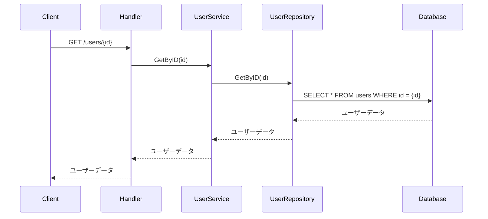

### POST /users (ユーザー作成)

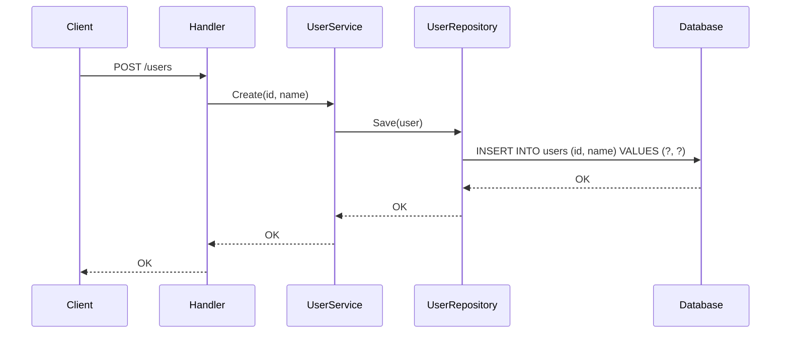

### PUT /users/{id} (ユーザー更新)

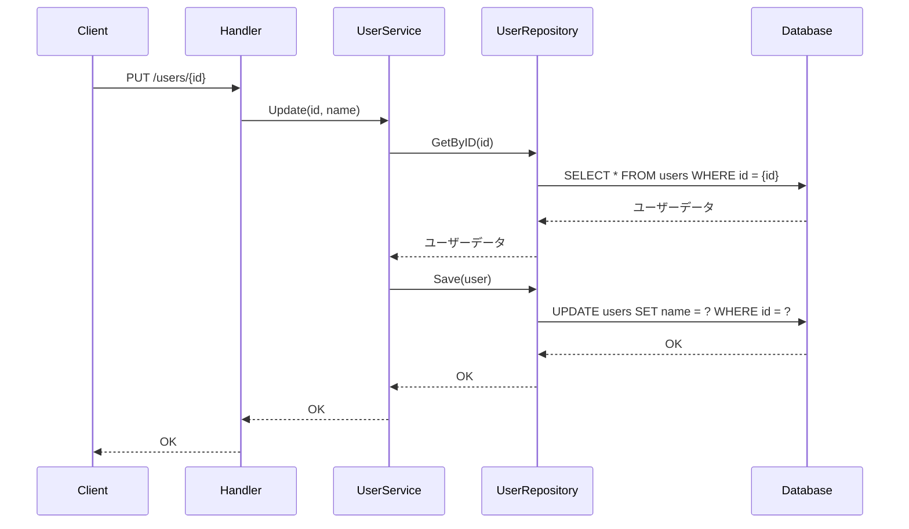

### DELETE /users/{id} (ユーザー削除)

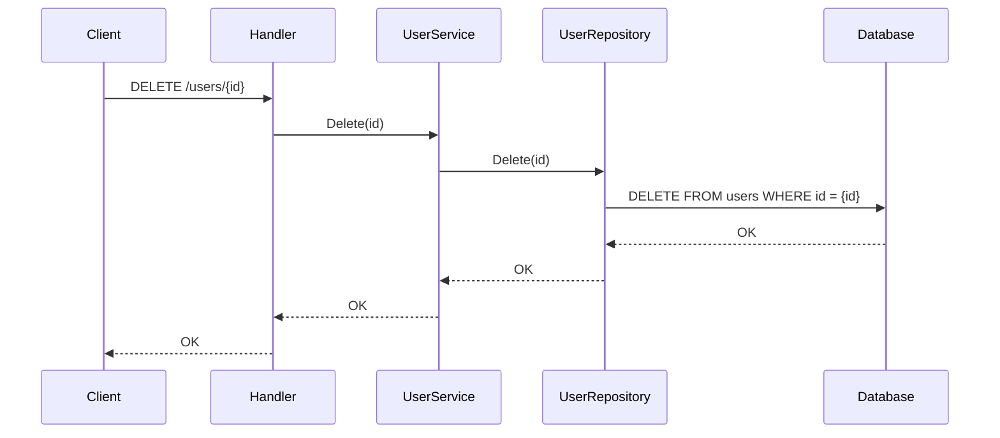

## 植物管理のシーケンス図

### POST /plants (植物登録)


### PATCH /plants/{id} (水やり記録)

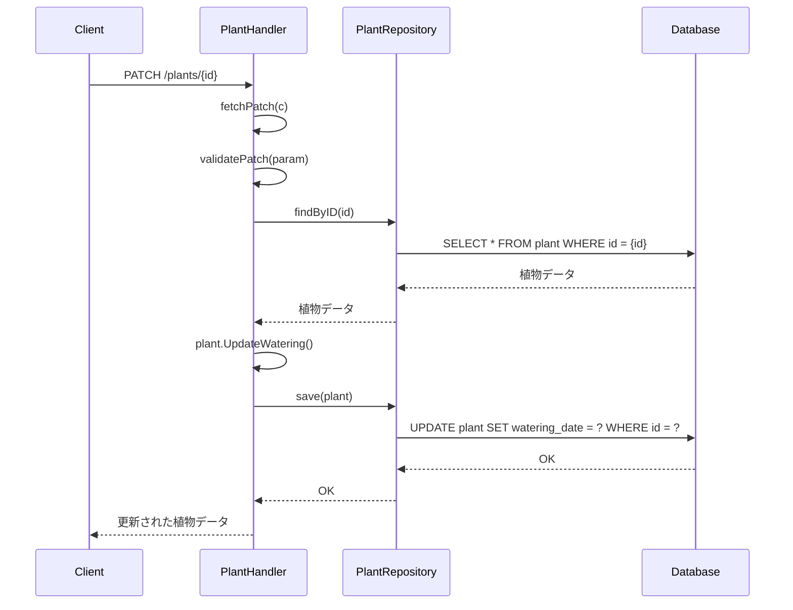

### GET /plants (植物一覧取得)

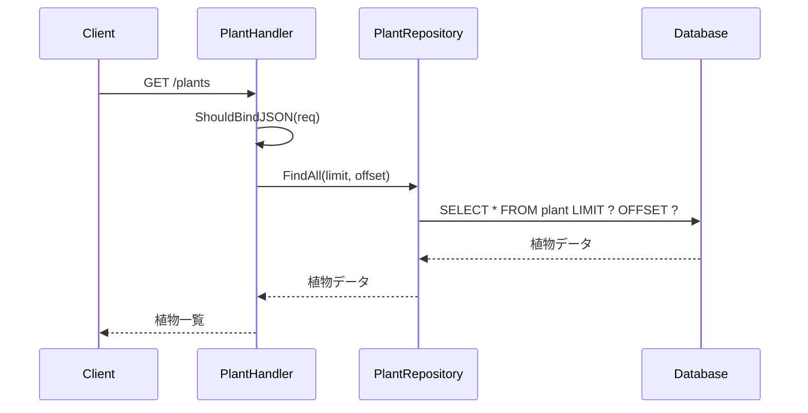
=======
# agent-test
for ai agent. ex .Devin

# DDD Project

This project is a basic implementation of Domain-Driven Design (DDD) principles in Go.

## Project Structure

- `command/user`: Contains the user command handlers and service.
- `entities`: Defines the core entities (e.g., User).
- `rdb`: Contains the database related files.

## Dependencies

- `github.com/gin-gonic/gin`: Web framework.
- `github.com/go-sql-driver/mysql`: MySQL driver.

## How to Run

1.  Install dependencies: `go mod tidy`
2.  Run the application: `go run main.go`

## Sequence Diagrams

### GET /users/{id}

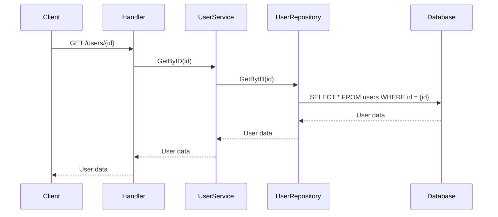

### POST /users


### PUT /users/{id}

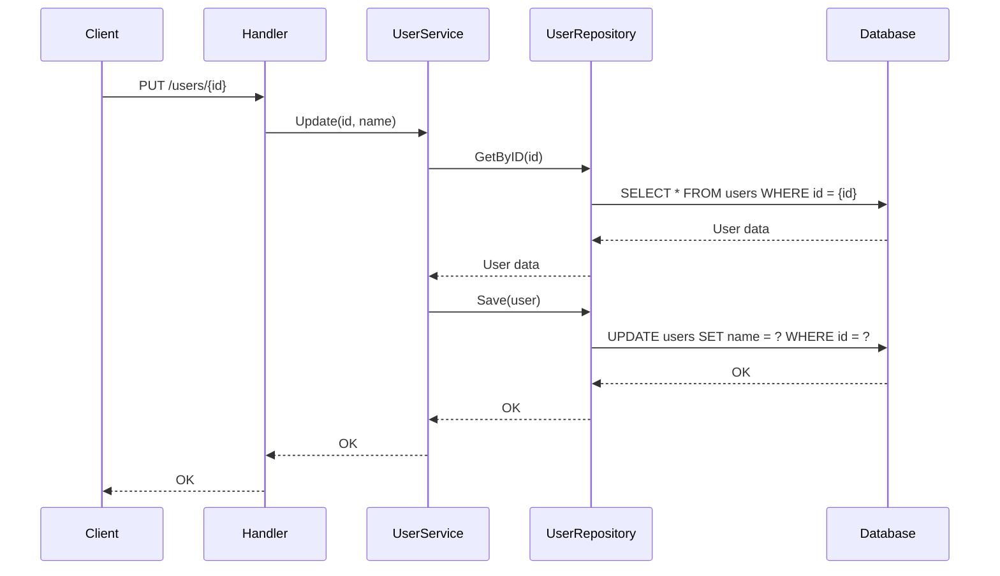

### DELETE /users/{id}


## ローカルDockerアーキテクチャ構成

### パターン1: バックエンド + データベース構成

ルートディレクトリの `docker-compose.yml` を使用した構成です。

```bash
cd ~/repos/agent-test
docker-compose up
```

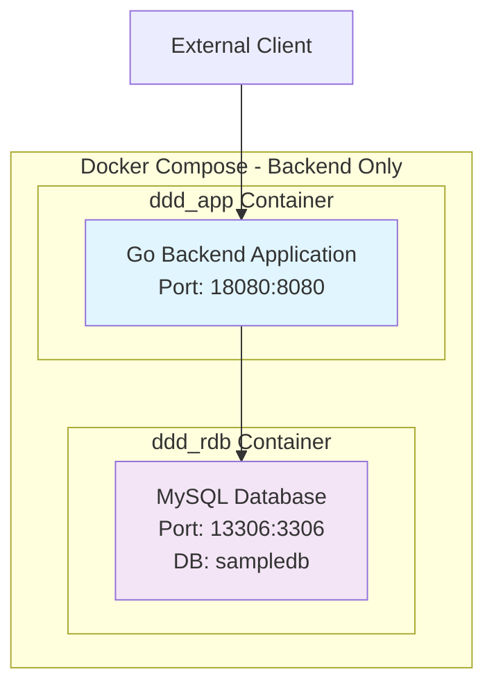

**起動するコンテナ:**
- `agent-test_ddd_app_1`: Goバックエンドアプリケーション
- `agent-test_ddd_rdb_1`: MySQLデータベース

### パターン2: フルスタック構成

フロントエンドディレクトリの `docker-compose.yml` を使用した構成です。

```bash
cd ~/repos/agent-test/frontend/plant-watering-app
docker-compose up
```

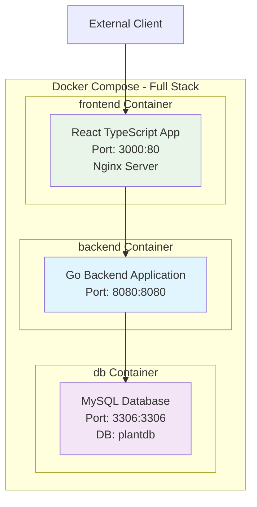

**起動するコンテナ:**
- `plant-watering-app_frontend_1`: React TypeScriptフロントエンド
- `plant-watering-app_backend_1`: Goバックエンドアプリケーション
- `plant-watering-app_db_1`: MySQLデータベース

### コンテナ確認コマンド

```bash
# 起動中のコンテナを確認
docker ps

# コンテナのログを確認
docker-compose logs

# 特定のサービスのログを確認
docker-compose logs [service_name]
```

### 推奨構成

フルスタック開発には**パターン2**を使用することを推奨します。フロントエンドとバックエンドの連携テストが可能になります。
