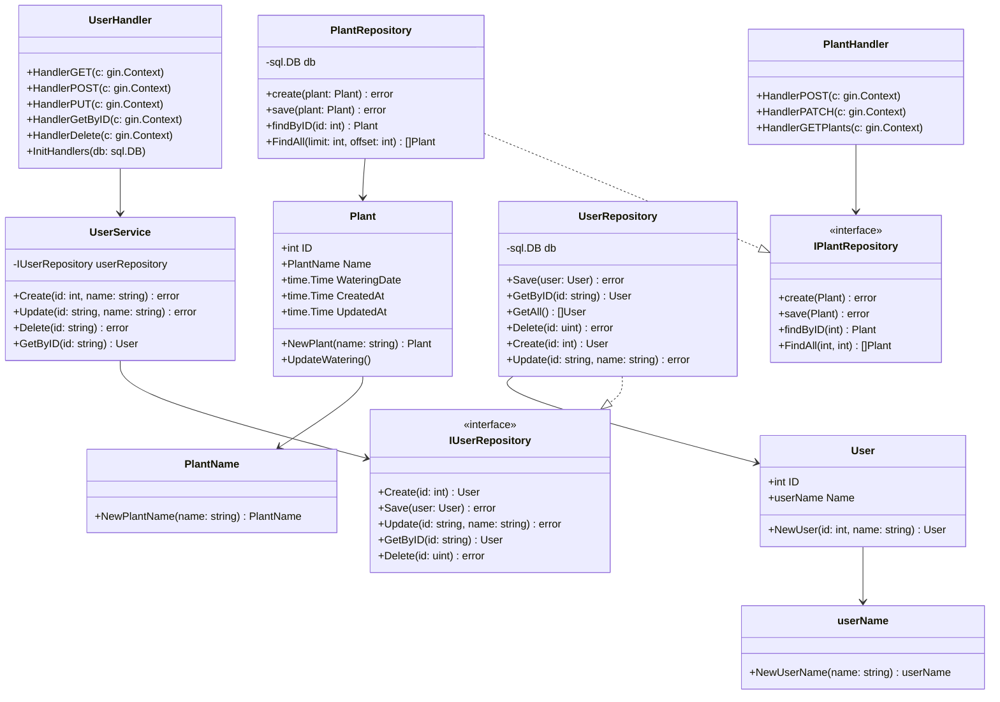
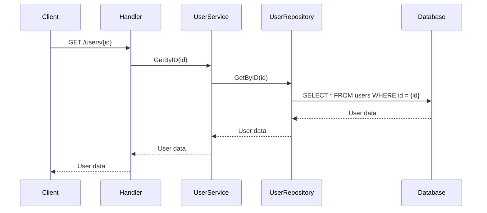
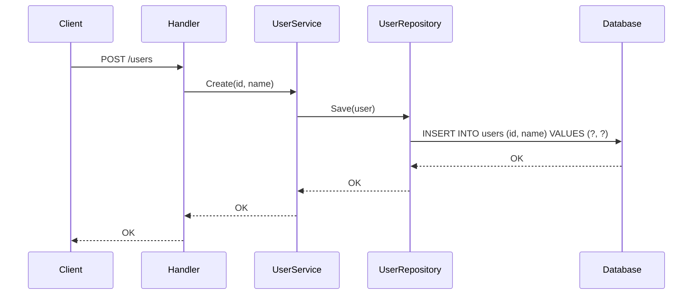
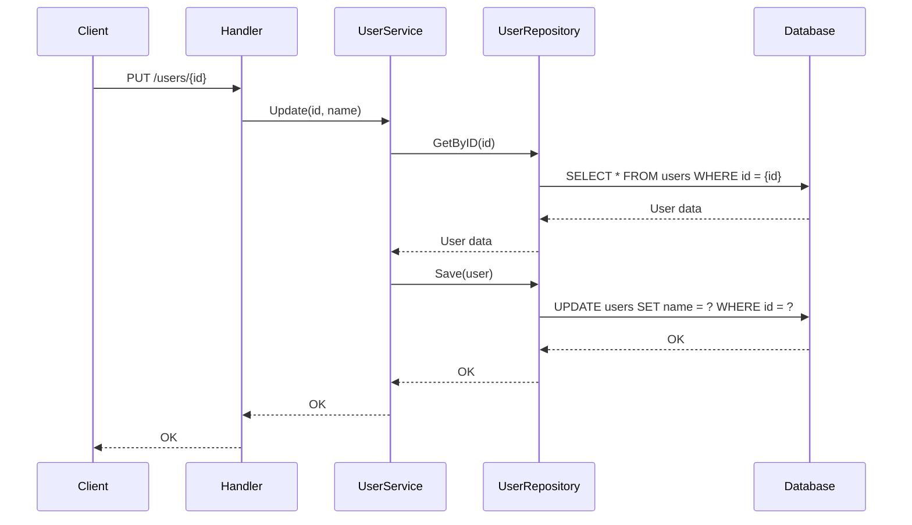
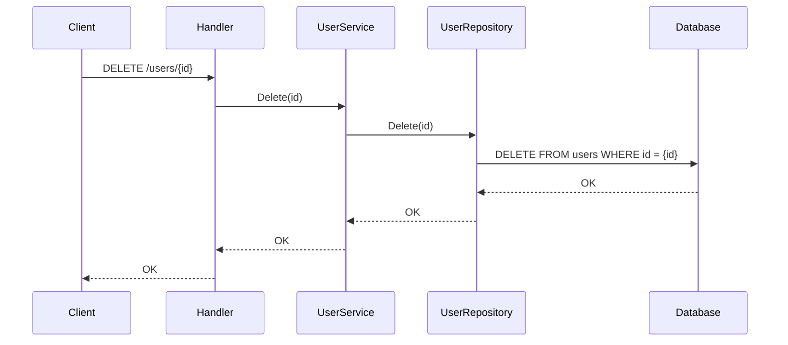
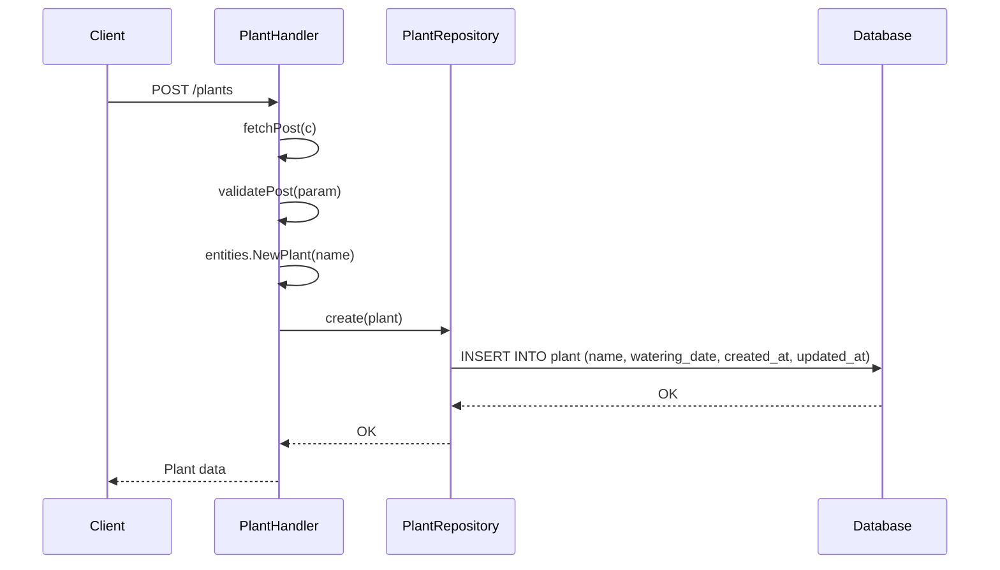
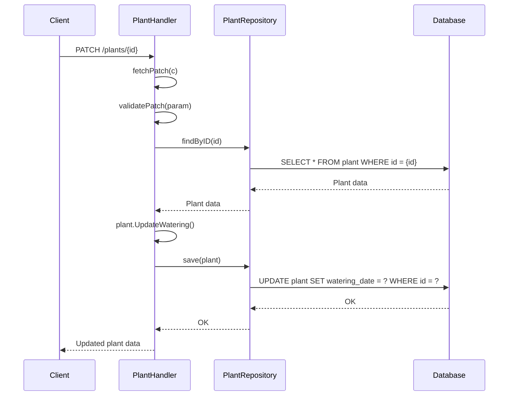
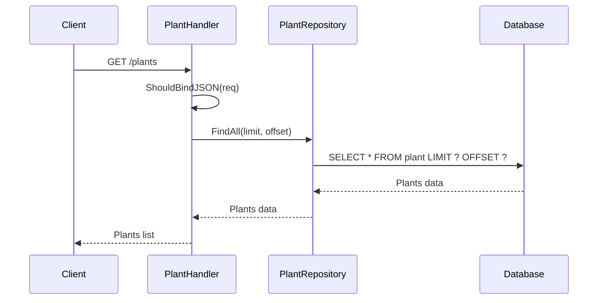

# DDD Project

This project is a basic implementation of Domain-Driven Design (DDD) principles in Go.

## Project Structure

- `command/user`: Contains the user command handlers and service.
- `entities`: Defines the core entities (e.g., User, Plant).
- `query/plant`: Contains the plant query handlers and repository.
- `rdb`: Contains the database related files.
- `migrations`: Database migration files.

## Dependencies

- `github.com/gin-gonic/gin`: Web framework.
- `github.com/go-sql-driver/mysql`: MySQL driver.

## How to Run

1.  Install dependencies: `go mod tidy`
2.  Run the application: `go run main.go`

## クラス図 (Class Diagram)

## ユースケース一覧 (Use Cases)

### ユーザー管理
- **UC-U1**: ユーザー登録 - 新しいユーザーを作成する
- **UC-U2**: ユーザー情報取得 - 特定のユーザー情報を取得する
- **UC-U3**: ユーザー一覧取得 - 全ユーザーの一覧を取得する
- **UC-U4**: ユーザー情報更新 - ユーザーの名前を更新する
- **UC-U5**: ユーザー削除 - ユーザーを削除する

### 植物管理
- **UC-P1**: 植物登録 - 新しい植物を登録する
- **UC-P2**: 植物一覧取得 - ユーザーの植物一覧を取得する
- **UC-P3**: 植物詳細取得 - 特定の植物の詳細情報を取得する
- **UC-P4**: 植物情報更新 - 植物の情報を更新する
- **UC-P5**: 植物削除 - 植物を削除する

### 水やり管理
- **UC-W1**: 水やり記録 - 植物に水やりを行い記録する
- **UC-W2**: 水やり履歴取得 - 植物の水やり履歴を取得する
- **UC-W3**: 水やり状態確認 - 前回の水やりからの経過日数を確認する
- **UC-W4**: 水やり記録削除 - 水やり記録を削除する

## Sequence Diagrams

### GET /users/{id}

### POST /users

### PUT /users/{id}

### DELETE /users/{id}

## 植物管理のシーケンス図 (Plant Management Sequence Diagrams)

### POST /plants (植物登録)

### PATCH /plants/{id} (水やり記録)

### GET /plants (植物一覧取得)

