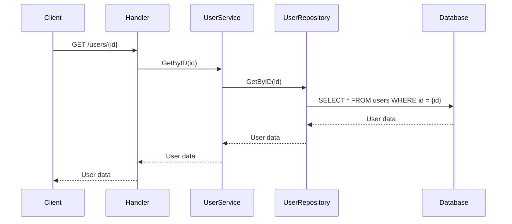
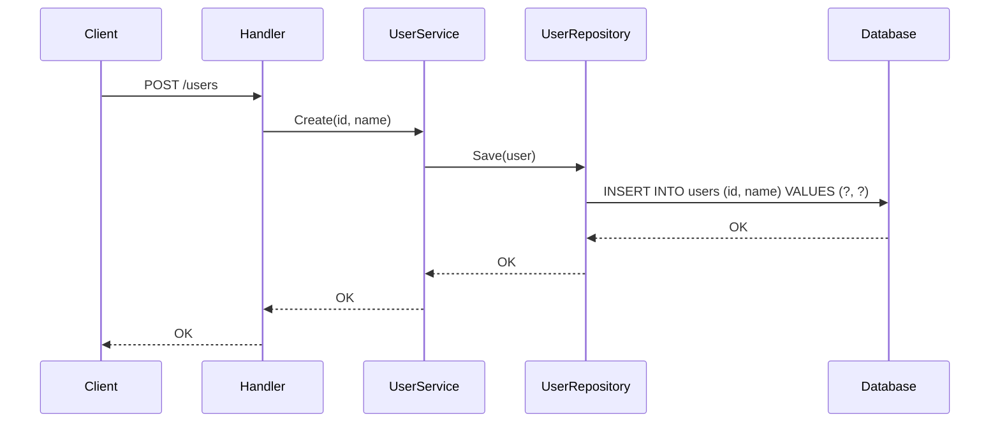
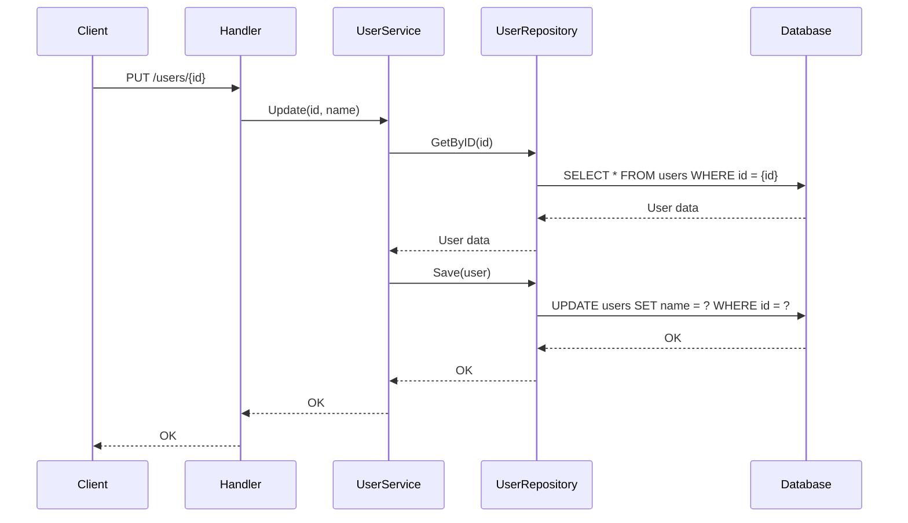
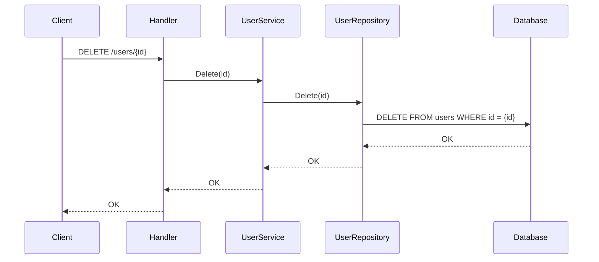

# agent-test
for ai agent. ex .Devin

# DDD Project

This project is a basic implementation of Domain-Driven Design (DDD) principles in Go.

## Project Structure

- `command/user`: Contains the user command handlers and service.
- `entities`: Defines the core entities (e.g., User).
- `rdb`: Contains the database related files.

## Dependencies

- `github.com/gin-gonic/gin`: Web framework.
- `github.com/go-sql-driver/mysql`: MySQL driver.

## How to Run

1.  Install dependencies: `go mod tidy`
2.  Run the application: `go run main.go`

## Sequence Diagrams

### GET /users/{id}

### POST /users

### PUT /users/{id}

### DELETE /users/{id}

>>>>>>> master
