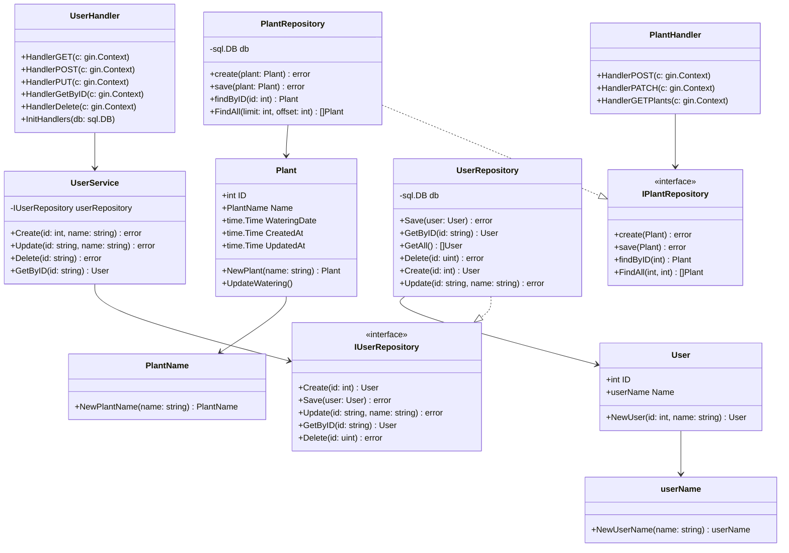
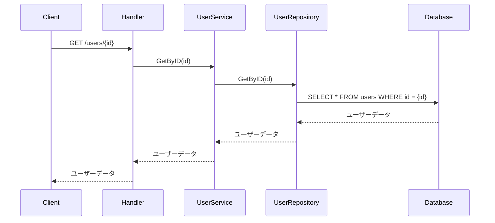
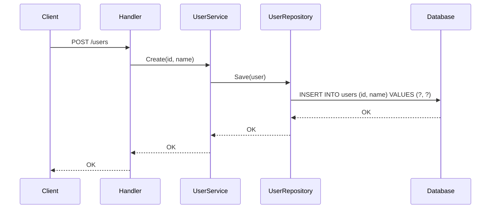
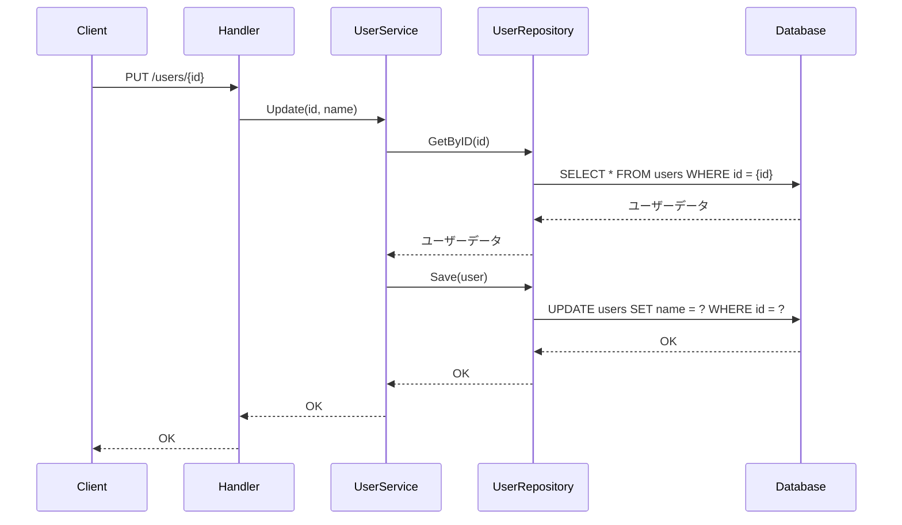
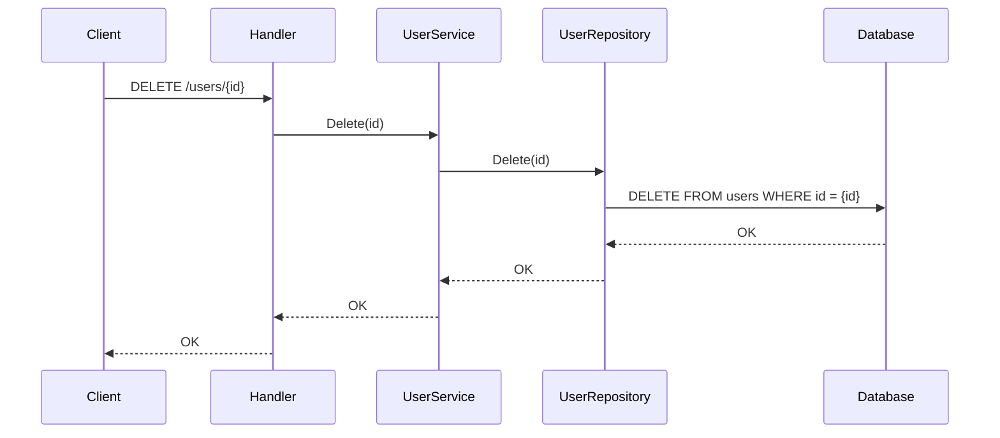
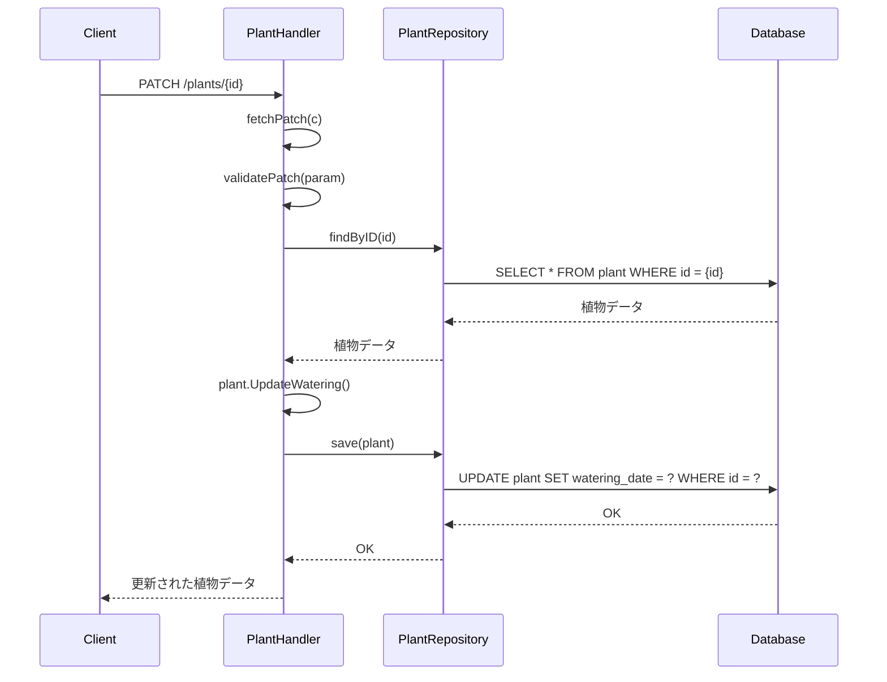
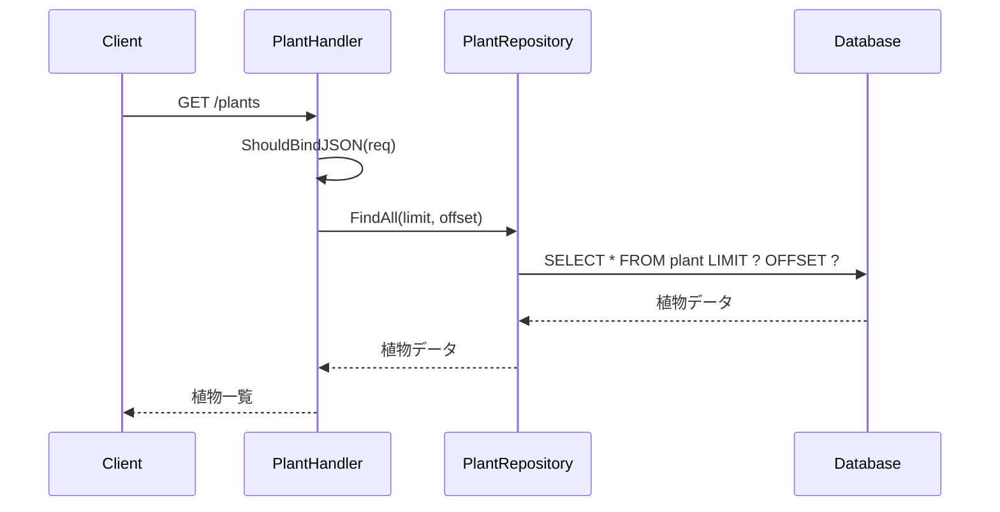

# DDDプロジェクト

このプロジェクトは、GoでDomain-Driven Design（DDD）の原則を基本的に実装したものです。

## プロジェクト構造

- `command/user`: ユーザーのコマンドハンドラーとサービスを含む
- `entities`: コアエンティティ（例：User、Plant）を定義
- `query/plant`: 植物のクエリハンドラーとリポジトリを含む
- `rdb`: データベース関連ファイルを含む
- `migrations`: データベースマイグレーションファイル

## 依存関係

- `github.com/gin-gonic/gin`: Webフレームワーク
- `github.com/go-sql-driver/mysql`: MySQLドライバー

## 実行方法

1.  依存関係をインストール: `go mod tidy`
2.  アプリケーションを実行: `go run main.go`

## クラス図

## ユースケース一覧

### ユーザー管理
- **UC-U1**: ユーザー登録 - 新しいユーザーを作成する
- **UC-U2**: ユーザー情報取得 - 特定のユーザー情報を取得する
- **UC-U3**: ユーザー一覧取得 - 全ユーザーの一覧を取得する
- **UC-U4**: ユーザー情報更新 - ユーザーの名前を更新する
- **UC-U5**: ユーザー削除 - ユーザーを削除する

### 植物管理
- **UC-P1**: 植物登録 - 新しい植物を登録する
- **UC-P2**: 植物一覧取得 - ユーザーの植物一覧を取得する
- **UC-P3**: 植物詳細取得 - 特定の植物の詳細情報を取得する
- **UC-P4**: 植物情報更新 - 植物の情報を更新する
- **UC-P5**: 植物削除 - 植物を削除する

### 水やり管理
- **UC-W1**: 水やり記録 - 植物に水やりを行い記録する
- **UC-W2**: 水やり履歴取得 - 植物の水やり履歴を取得する
- **UC-W3**: 水やり状態確認 - 前回の水やりからの経過日数を確認する
- **UC-W4**: 水やり記録削除 - 水やり記録を削除する

## シーケンス図

### GET /users/{id} (ユーザー取得)

### POST /users (ユーザー作成)

### PUT /users/{id} (ユーザー更新)

### DELETE /users/{id} (ユーザー削除)

## 植物管理のシーケンス図

### POST /plants (植物登録)

### PATCH /plants/{id} (水やり記録)

### GET /plants (植物一覧取得)

