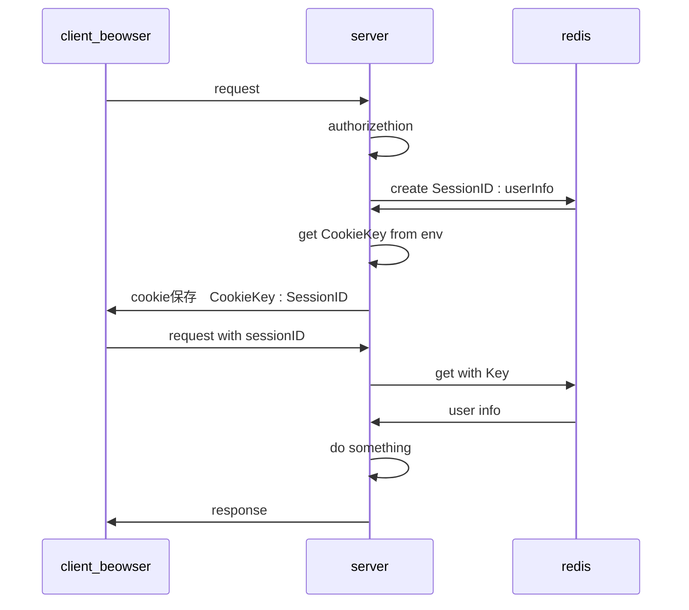

```mermaid

sequenceDiagram
  participant line_2 as client_beowser
  participant line_1 as server
  participant line_3 as redis
  line_2 ->> line_1: request
  line_1 ->> line_1: authorizethion 
  line_1 ->> line_3: create SessionID :  userInfo
  line_3 ->> line_1: 
  line_1 ->> line_1: get CookieKey from env
  line_1 ->> line_2: cookie保存　CookieKey : SessionID
  line_2 ->> line_1: request with sessionID
  line_1 ->> line_3: get with Key
  line_3 ->> line_1: user info
  line_1 ->> line_1: do something
  line_1 ->> line_2: response
```